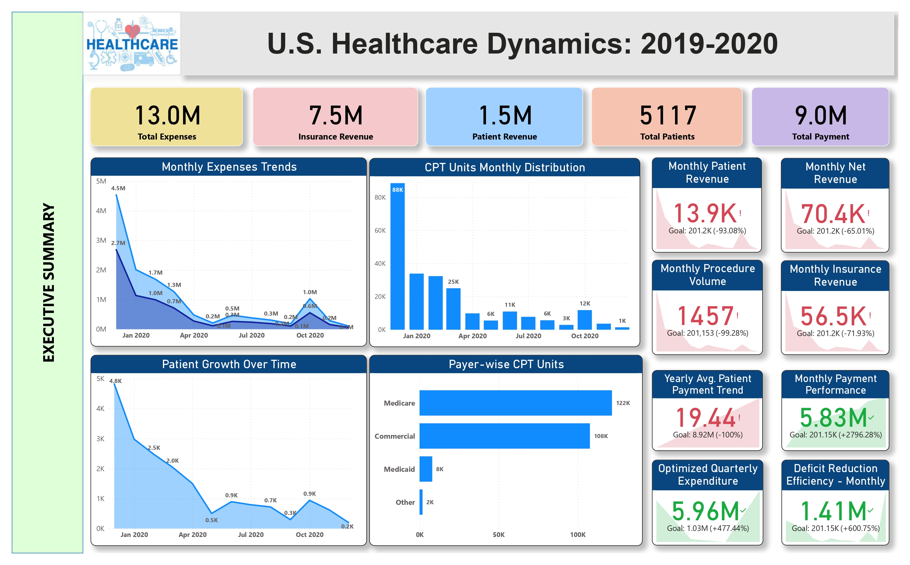

## 🏥 U.S. Healthcare Industry Dynamics Dashboard

A **Business Intelligence (BI) dashboard** project focused on analyzing the U.S. healthcare industry.  
This project explores market dynamics, growth trends, payer mix, cost drivers, and key metrics to help stakeholders understand the structure and performance of the healthcare sector.

---

## 📌 About

The **U.S. Healthcare Industry Dynamics Dashboard** transforms raw healthcare data into **actionable insights** through interactive visualizations. It highlights cost trends, insurance coverage, regional performance, and growth factors within the industry.  

The goal is to support **policy analysis, cost management, and market research** with a data-driven approach.

---

---

## ✨ Features

- 📊 **Healthcare Market Overview** – total expenditure, annual growth rates  
- 🏥 **Cost Drivers** – analysis of hospital, physician, and drug costs  
- 💳 **Payer Mix** – Medicare, Medicaid, private insurance, and out-of-pocket trends  
- 🌍 **Regional Comparisons** – spending patterns across states/regions  
- 🧑‍🤝‍🧑 **Demographics** – patient distribution by age and insurance coverage  
- ⏳ **Time Trends** – longitudinal analysis of costs and insurance rates  

---

## 📊 Dashboard Preview

| Executive Summary | Healthcare provider metrics | Hospital Insights | Monthly Expenses | Patient Outcome
|------------------|-----------|--------------|-----------|--------------|
|  |  |  |  |  |


---

## 🛠️ Tools & Tech

- **Power BI** 
- **Data Preparation**: Power Query / SQL / Python (Pandas)  
- **Visualization Best Practices** for BI dashboards  

---

## 🚀 Getting Started

1. **Clone this repository**  
   ```bash
   git clone https://github.com/Shivangkus/U.S.-Healthcare-Industry-Dynamics.git
   cd U.S.-Healthcare-Industry-Dynamics
